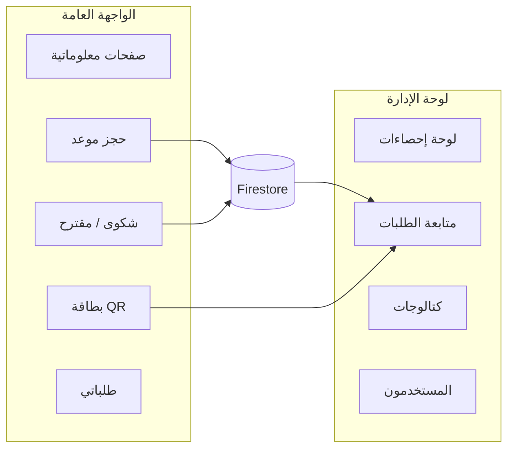
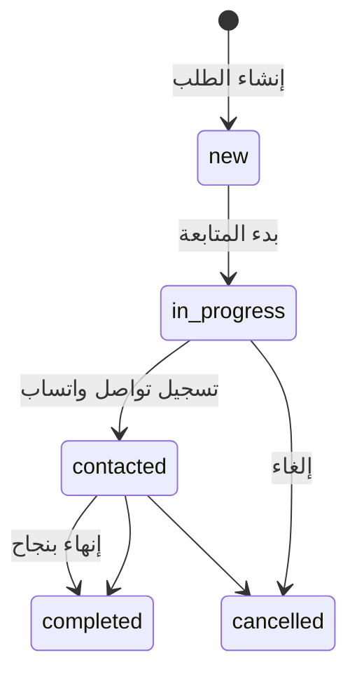

# بوابة إدارة الحجر الصحي بالقاهرة
## مستند عرض إداري — المميزات ومنطق العمل

**الإصدار:** مايو 2026  
**الجمهور:** الإدارة العليا، مدراء المكاتب، الفريق التقني (ملحق مختصر)  
**النظام (إنجليزي):** Cairo Quarantine Administration

---

## 1. الملخص التنفيذي

بوابة **إدارة الحجر الصحي بالقاهرة** منصة ويب متعددة اللغات تجمع بين:

1. **محتوى إرشادي** للمسافرين والمواطنين (خدمات، لقاحات، مكاتب، روابط رسمية).
2. **حجز مواعيد التطعيم** إلكترونياً مع بطاقة رقمية (QR) للعرض عند المكتب.
3. **تقديم شكاوى ومقترحات** مرتبطة بمكاتب محددة.
4. **لوحة إدارة** لمتابعة الطلبات، الإحصاءات، المستخدمين، والكتالوجات التشغيلية.

| البند | التفاصيل |
|--------|----------|
| اللغات | العربية (افتراضي)، الإنجليزية، الصينية — مع اتجاه نص RTL/LTR |
| الجمهور العام | مسافرون، حجاج ومعتمرون، مواطنون |
| مستخدمو اللوحة | سوبر أدمن، أدمن مكاتب، مستخدم مكتب |
| قاعدة البيانات | Firebase Firestore + Firebase Auth للإدارة |



---

## 2. الواجهة العامة — المحتوى والخدمات

### 2.1 الصفحات الإعلامية

| المسار | الوظيفة |
|--------|---------|
| `/{locale}/` | الصفحة الرئيسية: بطاقات الخدمات، إحصاءات المسافرين، جدول اللقاحات والأسعار، روابط PDF مهمة، جدول مواقع المكاتب |
| `/{locale}/international-traveler` | إرشادات **المسافر الدولي** |
| `/{locale}/hajj-umrah` | إرشادات **الحج والعمرة** |
| `/{locale}/citizen-services` | **خدمات المواطن** |
| `/{locale}/charter` | **ميثاق التطعيمات** |

**ملاحظة تشغيلية للإدارة:** صفحات فئات المسافرين **إعلامية فقط**. مسار الحجز الفعلي الموحّد هو **`/{locale}/booking`** — لا يوجد نموذج حجز منفصل داخل كل صفحة فئة.

### 2.2 خدمات مساعدة على كل الصفحات

| الخدمة | الوصف |
|--------|--------|
| زر الحجز العائم | يوجّه إلى صفحة الحجز |
| واتساب عائم | شكاوى واقتراحات (يُضبط الرقم عبر متغير البيئة `NEXT_PUBLIC_WHATSAPP_COMPLAINTS_PHONE`) |
| قراءة النص (TTS) | دعم إمكانية الوصول |
| PWA | إمكانية تثبيت الموقع كتطبيق على الجوال مع Service Worker |

### 2.3 اللغات والمحتوى

- محتوى الموقع الرئيسي (بطاقات، عناوين، جداول) مترجم في **ثلاث لغات**.
- **نموذج الحجز والشكوى** في الواجهة الحالية: نصوص **عربية ثابتة** (حتى عند فتح `/en` أو `/zh`).
- **بطاقة الحجز الإلكترونية** (صفحة QR والنسخة القابلة للتحميل): مترجمة حسب لغة الرابط.

---

## 3. رحلة المواطن — حجز موعد تطعيم

**المسار:** `/{locale}/booking`  
**البديل من الشكاوى:** يمكن التبديل من صفحة الشكوى إلى الحجز عبر مبدّل الوضع.

### 3.1 خطوات الحجز (بالترتيب)

1. **حالة المسافر** — تُحمَّل من كتالوج `traveler_states` في Firestore (قابل للتعديل من لوحة الإدارة). عند عدم الإعداد: دولي، حج وعمرة، مواطنين.
2. **المكتب** — قائمة المكاتب **النشطة** فقط، مُفلترة بحيث يظهر المكتب إذا كان يخدم الحالة المختارة.
3. **التاريخ المطلوب** — بتقويم يحترم قواعد توقيت القاهرة (انظر الجدول أدناه).
4. **الاسم** و**رقم الهاتف** و**ملاحظات** (اختيارية).
5. **التحقق من السعة اليومية** — يتم تلقائياً قبل الإرسال وعبر API أثناء اختيار التاريخ.
6. **بعد النجاح:** رقم طلب فريد، رسالة تأكيد، **رمز QR**، بطاقة **PNG** للتحميل أو المشاركة، رابط **«طلباتي»**.

### 3.2 قواعد التاريخ والوقت (توقيت القاهرة `Africa/Cairo`)

| القاعدة | التفاصيل |
|---------|---------|
| حجز **نفس اليوم** | مسموح إذا كان الوقت الحالي **قبل** ساعة القطع |
| ساعة القطع الافتراضية | **14:00** (الساعة 2 ظهراً) |
| تعديل ساعة القطع | من لوحة الإعدادات → السوبر أدمن فقط (`settings/app`) |
| بعد ساعة القطع | أدنى تاريخ قابل للاختيار = **غداً** |
| تاريخ في الماضي | **مرفوض** مع رسالة توضيحية |
| التحقق | على الخادم وفي المتصفح (حقل التاريخ `min`) |

### 3.3 السعة اليومية للمكتب

- كل مكتب يمكن ضبط **`dailyBookingCap`** (الحد الأقصى لحجوزات **يوم تقويمي واحد**).
- القيمة `null` أو غير محددة = **غير محدود**.
- عند الامتلاء: يُعطّل الإرسال ويظهر تنبيه «اليوم ممتلئ».
- العدّ يشمل طلبات من نوع **حجز موعد** فقط لنفس المكتب ونفس التاريخ.

### 3.4 ربط المكتب بحالات المسافر

| نوع خدمة المكتب | السلوك الافتراضي إن لم تُحدَّد حالات يدوياً |
|-----------------|---------------------------------------------|
| `hajj_umrah_travelers` | يخدم: دولي + حج وعمرة + مواطنين |
| `hajj_umrah_only` | يخدم: حج وعمرة + مواطنين فقط |

يمكن للسوبر أدمن تخصيص **`travelerStateIds`** لكل مكتب من شاشة المكاتب.

### 3.5 التحقق من بيانات الحجز

| الحقل | القواعد |
|--------|---------|
| المكتب | مطلوب، موجود، نشط، يخدم حالة المسافر |
| حالة المسافر | مطلوبة، من القائمة النشطة |
| التاريخ | صيغة `YYYY-MM-DD`، ضمن النطاق المسموح، ضمن السعة |
| الاسم | 2–120 حرفاً |
| الهاتف | 9–20 رقماً/رموزاً ضمن `+` وأرقام ومسافات و`()-` |
| الملاحظات | اختيارية، حتى 1000 حرف |

إن لم يكتب المستخدم ملاحظات، يُنشأ حقل **التفاصيل** تلقائياً من حالة المسافر والتاريخ.

### 3.6 الحماية من الإساءة (الواجهة العامة)

| العملية | الحد |
|---------|------|
| إرسال طلب (حجز/شكوى) | **10** طلبات كل **10 دقائق** لكل عنوان IP |
| التحقق من توفر الموعد | **60** طلباً في الدقيقة لكل IP |
| تحديث حالة «طلباتي» | **30** طلباً في الدقيقة، حتى **20** طلباً في الطلب الواحد |

---

## 4. بطاقة الحجز الإلكترونية (QR)

بعد كل حجز ناجح يحصل المواطن على **بطاقة رقمية** للعرض عند مكتب التطعيم.

| البند | التفاصيل |
|--------|----------|
| شكل الرابط | `/{locale}/booking/pass/{رقم-الطلب}?t={رمز-سري}` |
| صلاحية الرابط | **30 يوماً** من تاريخ إنشاء الطلب |
| الأمان | رمز عشوائي؛ مقارنة آمنة على الخادم؛ بدون الرمز الصحيح لا تُعرض البيانات |
| الخصوصية | **رقم الهاتف لا يظهر** على صفحة العرض العامة |
| محركات البحث | الصفحة `noindex` — لا تُفهرس |
| الاستخدام عند المكتب | مسح QR أو فتح الرابط → عرض: رقم الطلب، المكتب، النوع، الحالة، الاسم، التاريخ (للحجز)، التفاصيل، ملاحظات المتابعة |

يمكن **تحميل صورة PNG** للبطاقة أو مشاركتها (مثلاً عبر واتساب) قبل الوصول للمكتب.

---

## 5. رحلة المواطن — شكوى أو مقترح

**المسار:** `/{locale}/complaint`

| الفرق عن الحجز | التفاصيل |
|----------------|----------|
| نوع المتابعة | **شكوى** أو **مقترح** |
| التاريخ وحالة المسافر | **غير مطلوبين** |
| المكاتب | كل المكاتب النشطة (بدون فلتر حالة مسافر) |
| التفاصيل | **إلزامية** — 5 أحرف على الأقل، حتى 1000 حرف |
| بعد الإرسال | نفس آلية رقم الطلب والمتابعة (بدون تاريخ في البطاقة) |

---

## 6. متابعة الطلبات — «طلباتي»

**المسار:** `/{locale}/my-requests`

| البند | التفاصيل |
|--------|----------|
| التخزين | على **جهاز المتصفح** (localStorage) — ليس حساباً مسجلاً |
| الحد الأقصى | آخر **20** طلباً على الجهاز |
| التحديث | زر «تحديث» يرسل رقم الطلب + الهاتف للخادم ويعيد **الحالة** و**ملاحظات المتابعة** |
| الشرط | يجب أن يطابق الهاتف **نفس الرقم** المسجّل عند إنشاء الطلب |
| QR | يظهر إذا بقي الرمز السري محفوظاً على نفس الجهاز |

**تنبيه للإدارة:** تغيير الجهاز أو مسح بيانات المتصفح يفقد قائمة «طلباتي» محلياً — يمكن استعادة المتابعة برقم الطلب والهاتف فقط (بدون QR إن فُقد الرمز).

---

## 7. حالات وأنواع الطلبات

### 7.1 أنواع الطلب

| النوع | التسمية العربية |
|-------|------------------|
| `booking` | حجز موعد |
| `complaint` | شكوى |
| `proposal` | مقترح |

### 7.2 حالات المتابعة

| الحالة | التسمية | المعنى التشغيلي |
|--------|---------|------------------|
| `new` | جديد | وصل للنظام ولم يُعالج بعد |
| `in_progress` | قيد المتابعة | المكتب بدأ المعالجة |
| `contacted` | تم التواصل | غالباً بعد إرسال واتساب وتسجيل التواصل |
| `completed` | مكتمل | أُغلق الطلب بنجاح |
| `cancelled` | ملغي | أُغلق دون إتمام الخدمة |



### 7.3 توضيح مهم: لا يوجد «موافقة / رفض»

النظام **لا يستخدم** أزرار موافقة أو رفض رسمية. موظف المكتب يحدّث **الحالة** و**ملاحظات المتابعة** حسب سير العمل الفعلي. هذا يعكس واقع التواصل والمتابعة وليس قراراً قانونياً ثنائياً.

---

## 8. لوحة الإدارة — نظرة عامة

**تسجيل الدخول:** `/{locale}/admin/login` (بريد إلكتروني + كلمة مرور عبر Firebase Auth).

### 8.1 الأدوار والصلاحيات

| الدور | من يستخدمه | الصلاحيات الأساسية |
|-------|------------|---------------------|
| **سوبر أدمن** | إدارة الحجر المركزية | كل المكاتب والطلبات؛ إدارة المكاتب واللقاحات وحالات المسافرين؛ الإعدادات؛ سجل النشاط؛ أدوات البيانات المتقدمة؛ حذف نهائي للطلبات |
| **أدمن مكاتب** | مشرف على عدة مكاتب | طلبات المكاتب المسموحة؛ إنشاء/تعديل **مستخدمي مكتب** فقط ضمن تلك المكاتب |
| **مستخدم مكتب** | موظف مكتب واحد | طلبات **مكتبه فقط**؛ تحديث الحالة والملاحظات وواتساب |

### 8.2 حساب «بانتظار المراجعة»

لا يصل المستخدم للوحة الرئيسية إذا:

- الحساب **غير مفعّل** (`active = false`)، أو
- **مستخدم مكتب** بدون مكتب معيّن، أو
- **أدمن مكاتب** بدون قائمة مكاتب مسموحة

يُوجَّه إلى صفحة **بانتظار المراجعة** حتى يفعّله السوبر أدمن ويُكمل التعيين.

### 8.3 الشاشات الرئيسية

| الشاشة | المسار | الوظيفة |
|--------|--------|---------|
| لوحة التحكم | `/admin` | إحصاءات بالحالة والنوع؛ مخطط أسبوعي (90 يوماً)； أداء المكاتب؛ تصدير |
| الطلبات | `/admin/requests` | قائمة مع فلاتر وترقيم صفحات |
| تفاصيل طلب | `/admin/requests/[id]` | معالجة الطلب، واتساب، سجل نشاط الطلب |
| المكاتب | `/admin/offices` | إضافة/تعديل مكاتب، سعة يومية، حالات مسافر |
| حالات المسافرين | `/admin/traveler-states` | كتالوج حالات الحجز |
| اللقاحات | `/admin/vaccines` | جدول اللقاحات والأسعار (يظهر أيضاً للجمهور) |
| المستخدمون | `/admin/users` | حسابات لوحة الإدارة |
| الإعدادات | `/admin/settings` | ساعة قطع الحجز، قوالب واتساب، أدوات بيانات متقدمة |
| سجل النشاط | `/admin/activity` | تدقيق مركزي (سوبر أدمن) |

---

## 9. سير عمل المكتب (تشغيلي)

### 9.1 استلام الطلب

- **من اللوحة:** طلب جديد بحالة `new` يظهر في قائمة الطلبات (مع إشعار صوتي اختياري في اللوحة).
- **من المواطن:** مسح **QR** البطاقة أو فتح الرابط — نفس بيانات الطلب دون الحاجة لهاتف الموظف لرؤية رقم هاتف المواطن على الشاشة العامة.

### 9.2 المعالجة اليومية (خطوات مقترحة)

1. فتح تفاصيل الطلب من القائمة أو عبر QR.
2. مراجعة: النوع، المكتب، التاريخ (للحجز)، التفاصيل، الحالة الحالية.
3. اختيار **قالب واتساب** جاهز — يُملأ تلقائياً باسم العميل، رقم الطلب، المكتب، و**رابط البطاقة** إن وُجد.
4. إرسال الرسالة للعميل عبر تطبيق واتساب.
5. الضغط على **«تسجيل أنه تم التواصل»** → الحالة تصبح `contacted` مع تسجيل وقت آخر واتساب.
6. تحديث **الحالة** و**ملاحظات المتابعة** (مثلاً `in_progress` ثم `completed` أو `cancelled`).
7. كل تغيير يُسجَّل في **سجل النشاط** للتدقيق.

### 9.3 قوالب واتساب — المتغيرات المتاحة

| المتغير | المعنى |
|---------|--------|
| `{name}` | اسم العميل |
| `{phone}` | هاتف العميل |
| `{officeName}` | اسم المكتب |
| `{officeAddress}` | عنوان المكتب |
| `{officeMapUrl}` | رابط الخرائط |
| `{requestType}` / `{requestTypeAr}` | نوع الطلب |
| `{requestDetails}` | تفاصيل الطلب |
| `{requestId}` | رقم الطلب |
| `{preferredDate}` | التاريخ المفضل (حجز) |
| `{travelerStateAr}` | حالة المسافر |
| `{bookingPassUrl}` | رابط بطاقة الحجز الإلكترونية |

---

## 10. لوحة التحكم — الإحصاءات والتقارير

### 10.1 مؤشرات اللوحة الرئيسية

- عدد الطلبات حسب **الحالة** (جديد، قيد المتابعة، تم التواصل، مكتمل، ملغي).
- عدد الطلبات حسب **النوع** (حجز، شكوى، مقترح).
- **المخطط الزمني:** تجميع أسبوعي لآخر **90 يوماً**.
- **أداء المكاتب:** إجمالي، مفتوحة، مكتملة، ملغاة، و**نسبة إنجاز** = مكتمل ÷ (مكتمل + ملغي).

السوبر أدمن يمكنه تصفية اللوحة بمكتب واحد عبر `?officeId=`.

### 10.2 قائمة الطلبات والفلاتر

- تصفية حسب **الحالة**.
- تصفية حسب **تاريخ القاهرة** (اليوم، أمس، اليوم وأمس، الكل، أو من–إلى مخصص على `updatedAt`).
- ترتيب حسب تاريخ الإنشاء أو التحديث.
- **ترقيم صفحات** (cursor) لتحميل دفعات إضافية.
- عرض آخر نشاط مسجّل لكل طلب في القائمة.

### 10.3 التصدير إلى Excel

| البند | التفاصيل |
|--------|----------|
| من يصدّر | كل الأدوار ضمن نطاق صلاحياتهم |
| الصيغة | `.xlsx` |
| الحد الأقصى | **10,000** صف — مع تنبيه في رأس الاستجابة عند الاقتصار |
| الفلاتر | نوع الطلب، مكتب، حالة مسافر، نطاق تاريخ الإنشاء |

---

## 11. إدارة الكتالوجات (سوبر أدمن)

| الكتالوج | الغرض |
|----------|--------|
| **المكاتب** | الاسم، العنوان، الهاتف، الخرائط، نوع الخدمة، التفعيل، السعة اليومية، حالات المسافر |
| **حالات المسافرين** | تسميات عربية للقائمة في نموذج الحجز |
| **اللقاحات** | الأسماء والأسعار المعروضة للجمهور والإدارة |
| **قوالب الرسائل** | نصوص واتساب مع المتغيرات |
| **إعدادات الحجز** | ساعة قطع حجز «نفس اليوم» |

**أوامر البذر الأولية (تقني):**

```bash
npm run seed:offices
npm run seed:vaccines
npm run seed:traveler-states
npm run admin:create-profile -- <firebase-uid> admin@example.com "Super Admin"
```

---

## 12. إدارة المستخدمين

| العملية | سوبر أدمن | أدمن مكاتب |
|---------|-----------|------------|
| إنشاء سوبر أدمن / أدمن مكاتب | نعم | لا |
| إنشاء مستخدم مكتب | نعم | نعم (ضمن مكاتبه فقط) |
| تفعيل / إيقاف | نعم | نعم (ضمن النطاق) |
| حذف | نعم | نعم (ضمن النطاق) |

**قيود أمان:**

- لا يمكن حذف أو إيقاف **آخر سوبر أدمن نشط** في النظام.
- لا يمكن للمستخدم **إيقاف نفسه** أو سحب صلاحية السوبر أدمن من نفسه.
- أدمن المكاتب لا يدير إلا حسابات **مستخدم مكتب** في مكاتب مسموحة.

---

## 13. الأرشفة والاحتفاظ بالبيانات (سوبر أدمن)

| السياسة | المدة / الإجراء |
|---------|-----------------|
| أرشفة الطلبات المغلقة | `completed` أو `cancelled` وأقدم من **90 يوماً** من آخر تحديث → تُنقل إلى `requestsArchive` وتُحذف من `requests` |
| أرشفة سجل النشاط | أقدم من **90 يوماً** → `activityLogsArchive` |
| حذف الأرشيف نهائياً | بعد **6 أشهر** من تاريخ الأرشفة |
| دفعة واحدة | حتى **400** وثيقة (حد أقصى 500) — قد يتطلب عدة تشغيلات |
| تشغيل تلقائي | Cron خارجي: `POST /api/admin/maintenance/retention` مع `Authorization: Bearer {MAINTENANCE_CRON_SECRET}` |
| تشغيل يدوي | من **الإعدادات المتقدمة** في لوحة السوبر أدمن |

### 13.1 أدوات البيانات المتقدمة (سوبر أدمن فقط)

| الأداة | الحد / الشرط |
|--------|--------------|
| تصدير NDJSON | حتى **10,000** وثيقة لكل مجموعة |
| استيراد NDJSON/JSON | حتى **2,000** وثيقة في الاستدعاء |
| تنظيف (Purge) | حتى **5,000** وثيقة في الاستدعاء؛ يتطلب كتابة **عبارة تأكيد عربية** حرفياً |
| عمليات التنظيف | كل الطلبات؛ الشكاوى فقط؛ المقترحات فقط؛ سجل الإجراءات بالكامل |

---

## 14. ملحق تقني مختصر

*للفريق التقني ومن يرغب من الإدارة في فهم البنية دون الدخول في الكود.*

### 14.1 التقنيات

| الطبقة | التقنية |
|--------|---------|
| الواجهة | Next.js 16 (App Router)، React |
| المصادقة (إدارة) | Firebase Auth — بريد/كلمة مرور |
| قاعدة البيانات | Cloud Firestore |
| إنشاء طلبات الجمهور | Firebase Admin SDK على الخادم (لا إنشاء مباشر من متصفح الزائر) |

**مجموعات Firestore الرئيسية:** `requests`, `offices`, `users`, `traveler_states`, `vaccines`, `messageTemplates`, `activityLogs`, `settings/app`, وأرشيف `requestsArchive` / `activityLogsArchive`.

### 14.2 الأمان — نقاط رئيسية

| الآلية | التفاصيل |
|--------|----------|
| جلسة الإدارة | Cookie `cqm_admin_session` — `httpOnly`، مدة **5 أيام** |
| التحقق | كل إجراء إداري يُعاد التحقق منه على **الخادم** |
| قواعد Firestore | تحديث الطلب من العميل محدود بحقول: `status`, `notes`, `lastWhatsappAt`, `updatedAt`؛ سجل النشاط **للخادم فقط** |
| بطاقة الحجز | رمز سري عشوائي + انتهاء 30 يوماً + مقارنة timing-safe |
| حدود المعدل | على APIs العامة فقط (ليس على مسارات الإدارة بالكامل) |
| الحذف الحساس | تأكيد كتابة رقم الطلب (حذف طلب) أو عبارة عربية (تنظيف مجموعات) |

### 14.3 متغيرات البيئة (مرجع)

راجع [`README.md`](../README.md) — أهمها: مفاتيح Firebase العامة والخاصة، `MAINTENANCE_CRON_SECRET`, رقم واتساب الشكاوى.

---

## 15. ملاحق

### 15.1 جدول المسارات للمعاينة

استبدل `{locale}` بـ `ar` أو `en` أو `zh`:

| الوظيفة | المسار |
|---------|--------|
| الرئيسية | `/{locale}/` |
| حجز موعد | `/{locale}/booking` |
| شكوى / مقترح | `/{locale}/complaint` |
| طلباتي | `/{locale}/my-requests` |
| بطاقة QR | `/{locale}/booking/pass/{id}?t=...` |
| تسجيل دخول الإدارة | `/{locale}/admin/login` |
| لوحة الإدارة | `/{locale}/admin` |

**مثال عربي:** `https://your-domain.com/ar/booking`

### 15.2 قائمة تحقق للإدارة قبل التشغيل

- [ ] إعداد مشروع Firebase (Auth + Firestore + نشر `firestore.rules`)
- [ ] إنشاء أول **سوبر أدمن** وربطه في Firestore
- [ ] تشغيل بذر المكاتب واللقاحات وحالات المسافرين
- [ ] مراجعة **سعة يومية** كل مكتب حسب الطاقة الاستيعابية
- [ ] ضبط **ساعة قطع حجز نفس اليوم** (افتراضي 14:00)
- [ ] إعداد **قوالب واتساب** لكل سيناريو (تأكيد، تذكير، إلغاء...)
- [ ] إنشاء حسابات **مستخدمي المكاتب** وتفعيلها مع تعيين المكتب
- [ ] ضبط **Cron الأرشفة** الشهري/الأسبوعي مع `MAINTENANCE_CRON_SECRET`
- [ ] اختبار رحلة كاملة: حجز → QR → تحديث من اللوحة → «طلباتي»
- [ ] ضبط رقم **واتساب الشكاوى** في متغيرات البيئة

### 15.3 حدود معروفة (شفافية)

| الموضوع | التوضيح |
|---------|----------|
| لغة نموذج الحجز | عربية ثابتة في الواجهة رغم دعم 3 لغات للموقع |
| «طلباتي» | مرتبطة بالجهاز؛ تغيير الهاتف أو الجهاز يتطلب الرقم + رقم الطلب |
| حد التصدير | 10,000 صف — للتقارير الأكبر استخدم أدوات NDJSON أو فلاتر تاريخ |
| التوفر بدون Firebase | API التوفر يعيد «متاح» دون عدّ حقيقي — يتطلب إعداد Firebase للإنتاج |

---

## 16. مراجع داخل المشروع

| الموضوع | الملف |
|---------|--------|
| أنواع وحالات الطلب | `lib/office-requests/types.ts` |
| إرسال الحجز | `app/[locale]/(public)/booking/actions.ts` |
| صلاحيات الإدارة | `lib/office-requests/admin-access.ts` |
| التحليلات | `lib/office-requests/analytics.ts` |
| الأرشفة | `lib/office-requests/retention.ts` |
| صلاحية QR | `lib/booking-pass-token.ts` |

---

*نهاية المستند — للاستفسارات التقنية راجع فريق التطوير وملف `README.md` في جذر المشروع.*
